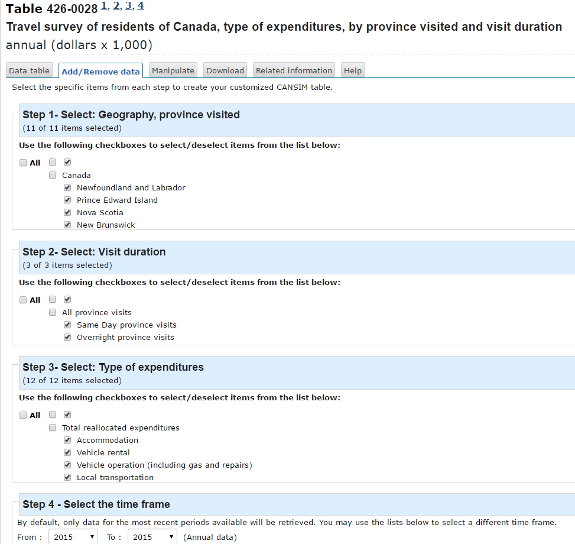

## Purpose

Statistics Canada recently released information on the 2015 Travel survey of residents of Canada, type of expenditures, by province visited and visit duration.

It seemed a good set of data to try out Kenton Russell's [sunburstR package](https://github.com/timelyportfolio/sunburstR)

```{r setup, include=FALSE}
knitr::opts_chunk$set(echo = TRUE, warning = FALSE, message = FALSE)

#required libraries
library(readr)
library(sunburstR)
library(dplyr)
```


## Data

I selected provincial data from one of several [Statistics Canada tables](http://www.statcan.gc.ca/daily-quotidien/160830/dq160830e-cansim-eng.htm) 

They allow for manipulation of the data prior to downloading as a csv. 

 I removed all the aggregated data for this purpose
and removed headers and footers from the resulting file    
   





``` {r munging, warning = FALSE}


# partially cleaned up data
df <- read_csv("data/travelSurvey.csv")
# add meaningful headers
names(df) <- c("Province","Visit","Type","Expenditure")
```


## Chart

There then only remained the need to create a sequence order for each expenditure level    
  Hover to see details including breadcrumbs

```{r chart production}


df %>% 
  mutate(seqs=paste(Province,Visit,Type,sep="-")) %>% 
  select(seqs,Expenditure) %>% 
  sunburst(count = TRUE)

```
    


Not necessarily the most effective way of providing information but it does provide a visually attractive interactive method of presenting the data

